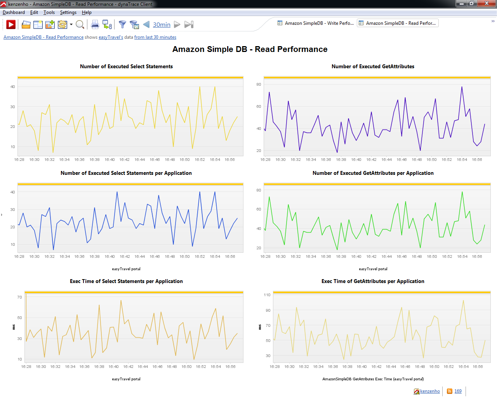
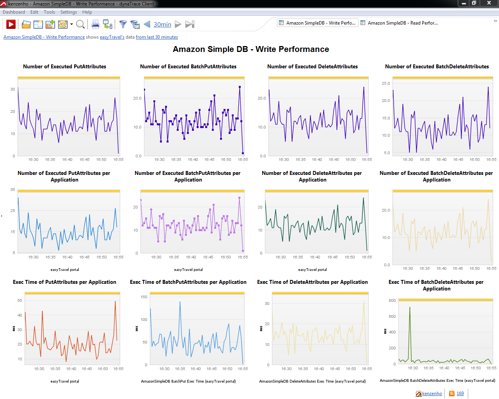

<head>

<link type="text/css" rel="stylesheet" href="css/blueprint/liquid.css" media="screen, projection"/>
<link type="text/css" rel="stylesheet" href="css/blueprint/print.css" media="print"/>
<!--[if lt IE 8]><link rel="stylesheet" href="css/blueprint/ie.css" type="text/css" media="screen, projection"/><![endif]-->
<link type="text/css" rel="stylesheet" href="css/content-style.css" media="screen, projection, print"/>
<link type="text/css" rel="stylesheet" href="css/screen.css" media="screen, projection"/>
<link type="text/css" rel="stylesheet" href="css/print.css" media="print"/>
</head>
<body>

<h4>Amazon SimpleDB Fastpack</h4>

<h3>Table of Contents
(<a href="Amazon_SimpleDB_Fastpack.html">Start</a>)
</h3>
<ul class="toc">
</ul>

<h1>Amazon SimpleDB Fastpack</h1>

<h2>Overview</h2>

<h3>Amazon SimpleDB</h3>

The dynaTrace FastPack for Amazon SimpleDB enables easy out-of-the-box monitoring of read and write performance of the Amazon SimpleDB usage via Java. The FastPack consists of a Sensor Pack, a Sample Profile and Dashboards. 

<h2>Fast Pack Details</h2>

<table>
<thead class=" "></thead><tfoot class=" "></tfoot><tbody class=" "> <tr>
<td rowspan="1" colspan="1">

Name 

</td>
<td rowspan="1" colspan="1">

<strong class=" ">Amazon SimpleDB FastPack</strong> 

</td>
</tr>
<tr>
<td rowspan="1" colspan="1">

Version 

</td>
<td rowspan="1" colspan="1">

1.0.0 

</td>
</tr>
<tr>
<td rowspan="1" colspan="1">

dynaTrace Version 

</td>
<td rowspan="1" colspan="1">

4.0 

</td>
</tr>
<tr>
<td rowspan="1" colspan="1">

Author 

</td>
<td rowspan="1" colspan="1">

dynaTrace - Klaus Enzenhofer 

</td>
</tr>
<tr>
<td rowspan="1" colspan="1">

License 

</td>
<td rowspan="1" colspan="1">

<a href="attachments_5275722_2_dynaTraceBSD.txt">dynaTrace BSD</a> 

</td>
</tr>
<tr>
<td rowspan="1" colspan="1">

Support 

</td>
<td rowspan="1" colspan="1">

<a href="https://community/display/DL/Support+Levels#SupportLevels-Community">Not Supported </a> 

</td>
</tr>
<tr>
<td rowspan="1" colspan="1">

FastPack Contents 

</td>
<td rowspan="1" colspan="1">

<a href="attachments_174752128_1_dynaTrace_AmazonSimpleDB_FastPack.dtp">Fastpack Download</a> contains: 

<ul class=" "><li class=" "> 

Amazon Simple DB - Read Performance Dashboard 

</li><li class=" "> 

Amazon Simple DB - Write Performance Dashboard 

</li><li class=" "> 

Sample System Profile 

</li><li class=" "> 

Sensorpack 

</li></ul> </td>
</tr>
</tbody> </table>

<h2>Amazon Simple DB - Read Performance Dashboard</h2>

The Amazon Simple DB - Read Performance Dashboard enables you to monitor the read performance of your SimpleDB. It shows you 

<ul class=" "><li class=" "> 

the total number of Executed Select and GetAttributes Calls 

</li><li class=" "> 

the total number of Executed Select and GetAttributes Calls per Application 

</li><li class=" "> 

the total Execution Time of Select and GetAttributes Calls 

</li></ul> 

<h2>Amazon Simple DB - Write Performance Dashboard</h2>

The Amazon Simple DB - Write Performance Dashboard enables you to easily monitor the write performance of your SimpleDB. It shows you 

<ul class=" "><li class=" "> 

the total number of Executed putAttributes, batchPutAttributes, deleteAttributes and batchDeleteAttributes Calls 

</li><li class=" "> 

the total number of Executed putAttributes, batchPutAttributes, deleteAttributes and batchDeleteAttributes Calls per Application 

</li><li class=" "> 

the total Execution Time of putAttributes, batchPutAttributes, deleteAttributes and batchDeleteAttributes Calls 

</li></ul> 

<h2>FastPack Information</h2>

The Amazon SimpleDB contains everything you need to start monitoring the Performance of the SimpleDB using the Java API provided by Amazon. 

<ul class=" "><li class=" "> 

The system profile contains the necessary measures 

</li><li class=" "> 

The Amazon Simple DB - Read Performance Dashboard for monitoring the performance of the most common read Operations 

</li><li class=" "> 

The Amazon Simple DB - Write Performance Dashboard for monitoring the performance of the most common write Operations 

</li></ul> 

<h2>Installation</h2>

Just download and import the FastPack on your dynaTrace Server (see <a href="https://community/display/DOCDT40/Plugin+Management">Plugin Management</a>) 

Created with <a href="http://k15t.com/display/en/Scroll-Wiki-HTML-Exporter-for-Confluence-Overview">Scroll Wiki HTML Exporter for Confluence</a>.

</body>
</html>
